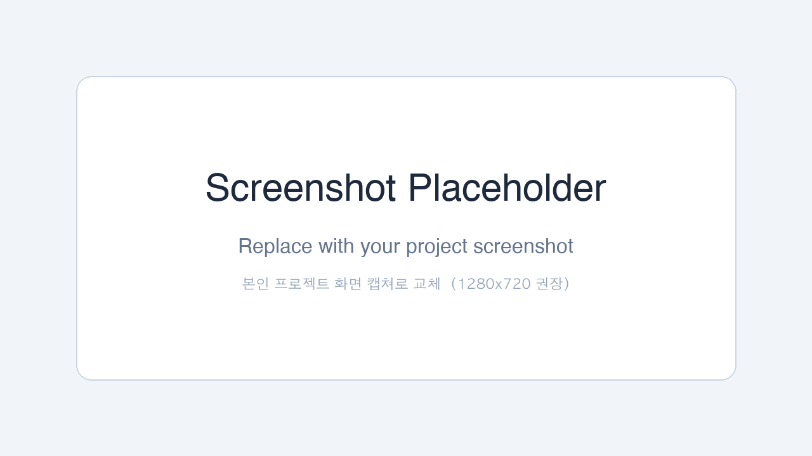

# 9주차 — 데모 소개 페이지 템플릿 (`week09_demo_intro`)

> 본인 프로젝트(예: 6주차 칼로리카운터, 또는 본인이 만든 다른 프로젝트)를 소개하는 정적 1페이지 사이트.
> Cloudflare Pages에 올려서 `<본인 ID>.aiweb2026.site`로 배포한다.
> 9주차에는 placeholder 상태로 띄우고, 10주차에 진짜 데모 링크가 살아남.

---

## 📁 파일 구성

| 파일 | 역할 | 학생이 교체? |
|------|------|--------------|
| `index.html` | 페이지 본문 (Hero · 데모 카드 · Tech Stack · 어떻게 만들었나 · Giscus) | ✅ 5~6곳 placeholder 교체 |
| `style.css` | 스타일 (1열 모바일 반응형 + 다크/라이트 자동) | ❌ 손대지 마세요 |
| `screenshot.png` | 데모 스크린샷 placeholder (1280×720) | ✅ 본인 프로젝트 캡쳐로 교체 |
| `README.md` | 본 가이드 | ❌ |

---

## 🚀 사용 흐름 (9주차)

```
1. 이 zip 압축 해제
2. 본인 GitHub에 새 PUBLIC 리포 만들기 (예: <username>/s01-aiweb2026)
3. 4개 파일 모두 push
4. Cloudflare Pages → Connect to Git → 본인 리포 → Deploy
5. <project>.pages.dev 접속 확인
6. index.html placeholder 교체 → push → 1~2분 후 반영 확인
7. 강사가 클래스 zone에 CNAME 등록 → <id>.aiweb2026.site로 접속 가능
8. Giscus 위젯 통합 (SECTION 8 참조)
9. 동료 사이트 댓글 달기 + 본인 사이트 댓글 받기
```

---

## ✏️ 교체할 placeholder

`index.html`을 열면 `⬇⬇⬇ 본인 정보로 교체 ⬇⬇⬇` 마커가 6군데 있습니다. 본인 프로젝트 정보로 채우세요.

> 💡 어떤 프로젝트를 소개해도 OK — 6주차 칼로리카운터, 본인이 따로 만든 프로젝트, 학기 중 다른 결과물 모두 가능.

### 1. `<title>` + `<meta description>` (line 6~9)
```html
<title>🚀 [본인 프로젝트 이름] — by <본인 익명 ID></title>
<meta name="description" content="[본인 프로젝트 한 줄 설명]" />
```
→ `[본인 프로젝트 이름]`, `[본인 프로젝트 한 줄 설명]`, `<본인 익명 ID>` 세 자리를 본인 정보로 교체.

### 2. Hero 영역 (line 18~21)
```html
<h1>🚀 [본인 프로젝트 이름]</h1>
<p class="tagline">[프로젝트가 무엇을 하는지 한 줄로]</p>
```
→ 프로젝트 이름 + 한 줄 catchphrase. 이모지는 자유롭게 (예: 🍱 음식, 🎨 그림, 🤖 챗봇 등).

### 3. 데모 카드 — 스크린샷 (line 28~30)
```html

```
→ 같은 폴더의 `screenshot.png`를 본인 프로젝트 화면 캡쳐로 덮어쓰기. (alt 텍스트도 본인 데모에 맞게)

### 4. 데모 카드 — 버튼 2개 (line 33~43)
```html
<a class="btn btn-primary" href="#" aria-disabled="true" title="다음 주에 살아납니다">
  ▶ Live Demo <span class="badge">Coming Week 10</span>
</a>
...
<a class="btn btn-secondary" href="https://github.com/<본인 GitHub username>/<본인 프로젝트 리포>" target="_blank" ...>
```
→ 9주차 오늘은 Live Demo 버튼은 그대로 두기. **10주차에 첫 번째 버튼 `href="#"` 를 `href="https://<본인 ID>-demo.aiweb2026.site"`로 교체.**
→ 두 번째 버튼의 GitHub URL은 본인 프로젝트 리포로.

### 5. Tech Stack (line 51~57)
```html
<ul class="stack">
  <li>[기술 1]</li>
  <li>[기술 2]</li>
  <li>[기술 3]</li>
  ...
</ul>
```
→ 본인 프로젝트가 실제로 쓴 기술로 교체. 다음 주 배포에 쓸 Docker / Oracle / GitHub Actions는 그대로 둬도 OK.

### 6. "어떻게 만들었나" (line 64~70)
```html
<p>
  [무엇을 만들었나 — 프로젝트의 핵심 기능 한 문장.]
  [어떤 기술 / 모델 / API 를 써서 어떻게 동작시키는가.]
  [사용자가 어떻게 쓰는가 — 입력은 무엇, 출력은 무엇.]
</p>
```
→ 본인 프로젝트를 3줄로 설명. 무엇을 / 어떻게 / 어떤 기술로.

---

## 💬 Giscus 위젯 통합 (SECTION 8에서)

`index.html` 하단 `<section id="comments">` 안에 placeholder script가 있습니다. 9주차 SECTION 8에서:

1. https://giscus.app/ko 접속 → 본인 리포 입력 → 자동 생성된 script 복사
2. `index.html`의 기존 `<script src="https://giscus.app/client.js" ...>` 통째 교체
3. `data-repo` / `data-repo-id` / `data-category-id` 세 값이 본인 것으로 채워져야 함

---

## 🔍 검증 체크리스트

- [ ] `<title>`이 본인 프로젝트 이름으로
- [ ] Hero 제목 + 한 줄 설명이 본인 정보
- [ ] `screenshot.png`가 본인 프로젝트 캡쳐
- [ ] "Source on GitHub" 링크가 본인 프로젝트 리포로 연결
- [ ] Tech Stack이 본인 프로젝트 실제 사용 기술
- [ ] "어떻게 만들었나"가 본인 프로젝트 설명
- [ ] Giscus script의 `data-repo`가 본인 리포로
- [ ] 페이지 하단에 GitHub 로그인 버튼이 있는 댓글창이 보임

---

## ⚠️ 자주 막히는 함정

| 증상 | 원인 | 해결 |
|------|------|------|
| Pages 빌드 실패 `command not found` | Framework preset 자동 감지 잘못 | preset = **None**, build command **공란** |
| Giscus 댓글창 안 뜸 | 리포 PRIVATE / Discussions OFF / giscus 앱 미설치 | SECTION 8의 3종 체크리스트 |
| 522 에러 (커스텀 도메인) | zone에 CNAME만, Pages에 도메인 미등록 | Pages → Custom domains 먼저 등록 |
| `screenshot.png` 너무 큼 | Cloudflare Pages 자산당 25 MiB 한도 | 1280×720 / 압축 (TinyPNG 등) |
| 모바일에서 글자 안 보임 | screenshot 해상도 낮음 | 1280×720 이상 권장 |

---

## 📝 10주차에서 할 일 (다음 주 예고)

1. Oracle 서버에 본인 프로젝트 Docker 배포 → `<id>-demo.aiweb2026.site` 작동
2. 본 페이지의 "Live Demo" 버튼 `href="#"` → `href="https://<id>-demo.aiweb2026.site"` 교체
3. push → Cloudflare Pages 자동 빌드 → 버튼 살아남
4. 동료들이 9주차에 단 댓글 thread에 답글 ("이제 데모 진짜 작동해요!")

---

## 출처

- 본 템플릿: `00_for_me/src/week09_demo_intro/`
- 9주차 강의안: `00_for_me/docs/09_week09.html`
- 분배표: `00_for_me/docs/student_subdomain_assignments.md`
